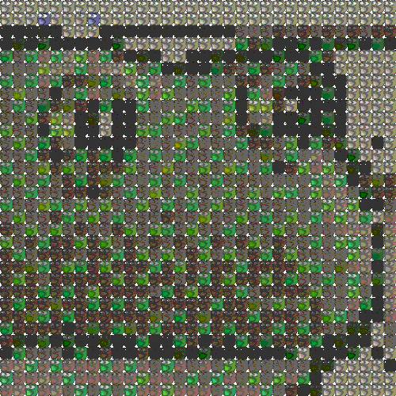

# Image Emotify

## Usage

```sh
# Generating GIF using PNG
python3 run.py image.png emote.gif

# Generating GIF using GIF
# Image must be a GIF when using the ``--gif-source`` flag
python3 run.py image.gif emote.gif --gif-source
```

```
PNG to GIF
----------

Emote Size:      112 x  112 (10 frames)
Input Size:      128 x  128

Progress:       Frame 7 of 10
```

## Configuration

```ini
[graphics]
EmotesPerLine = 32          # Number of emotes on one row in output GIF
FinalOutputWidth = 1024     # Pixel width of the output GIF
FrameDelay = 45             # Number of milliseconds between GIF frames
```

## Demo

These are examples created using Discord emojis. Try enabling GitHub dark mode for a better view.


